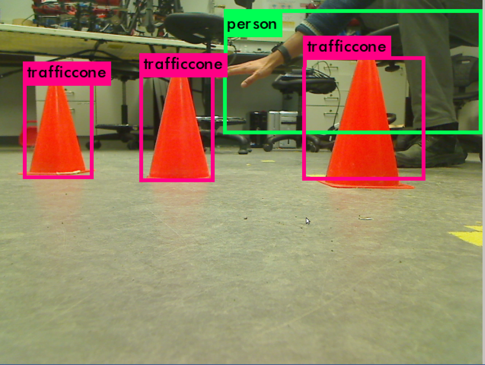

# duke-cone

Neural Network based EKF Localization. For the reason behind the name, google duke cone :)

An implementation of object-based localization method using neural networks.
 
## Requirements : Software
This project relies on the following open-source projects :
- [Yolo](https://github.com/pjreddie/darknet)
- [Tensorflow](https://www.tensorflow.org/)
- [Ros Indigo](http://wiki.ros.org/indigo)
- [Mocap optitrack](https://github.com/h2r/mocap_optitrack)
- [Yolo tf](https://github.com/gliese581gg/YOLO_tensorflow)
- [Image Annotation Tool](https://github.com/tzutalin/labelImg)

## Requirements : Hardware
- [Turtlebot Robot](https://www.clearpathrobotics.com/turtlebot-2-open-source-robot/)
- NVIDIA Titan X GPU
- Mocap_optitrack

## Trained Model
Yolo was trained on traffic cone images.
- [Traffic cone dataset](https://www.dropbox.com/s/fag8b45ijv14noy/cone_dataset.tar.gz?dl=0)
- [Yolo model](https://www.dropbox.com/sh/2sp9hkcg9twntvo/AABi0CitQr8ziLUnA5Zjpygwa?dl=0) Yolo trained on Pascal VOC + additional class (traffic cone) 

All code has been developed in Python (with the exception of external motion capture code), with Robot Operating System (ROS) wrappers and tested on Ubuntu 14.04.

Link to the video :
https://youtu.be/OcQGvapoJCg

